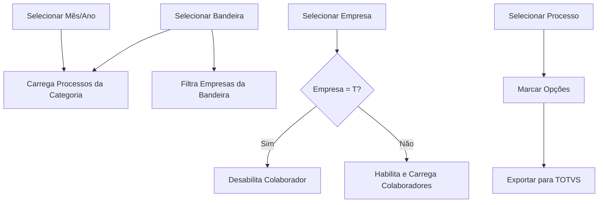

# Documentação - Modal de Exportação para TOTVS

## 📋 Visão Geral

Modal de exportação de dados Unimed/GSV/SAN para o sistema TOTVS RM, implementado na página `/importacao` seguindo a estrutura do sistema legado npd-legacy.

**Localização**: `src/pages/importacao/index.vue`  
**Componente**: Dialog "Processamento de Exportação"  
**Serviço HTTP**: `src/services/http/Exportacao/index.ts`

---

## 🎯 Campos do Formulário

### 1. Período de Referência

- **Mês** (obrigatório) - Dropdown com 12 meses
- **Ano** (obrigatório) - Dropdown com últimos 5 anos
- **Função**: Define o período dos dados a serem exportados

### 2. Bandeira (obrigatório)

Filtro principal que determina a categoria de processos e empresas disponíveis:

| Código | Nome   | Cor     | Categoria |
| ------ | ------ | ------- | --------- |
| U      | Unimed | Verde   | UNI       |
| G      | GSV    | Azul    | GSV       |
| S      | SAN    | Laranja | SAN       |

**Comportamento**:

- Ao selecionar bandeira: carrega processos da categoria correspondente
- Filtra empresas pela bandeira selecionada (via `codBand`)

### 3. Empresa (obrigatório)

Dropdown dinâmico com empresas filtradas pela bandeira + opção especial:

- **"T" (Todas)** - Exporta para todas as empresas da bandeira
- **Siglas específicas** - Ex: AF, BM, etc. (apelido da empresa)

**Mapeamento de bandeiras**:

```javascript
codBand: 3 = Unimed (U)
codBand: 1 = GSV (G)
codBand: 2 = SAN (S)
```

### 4. Colaborador (opcional)

- **Autocomplete** com colaboradores da empresa selecionada
- **Desabilitado** quando empresa = "Todas" (T)
- **Validação**: Requer empresa específica (backend rejeita CPF com empresa="T")
- Carrega via: `GET /common/colaboradores?codEmpresa={id}&codColigada={id}`

---

## 📊 Lista de Processos

### Carregamento Dinâmico

Endpoint: `GET /exportacao/processos`

**Parâmetros**:

```typescript
{
  categoria: "UNI" | "GSV" | "SAN",  // Baseado na bandeira
  tipoDado: "C",                      // Fixo (C = Comissão)
  mesRef: number,                     // Mês selecionado
  anoRef: number                      // Ano selecionado
}
```

**Response**:

```typescript
interface ProcessoParaExportacao {
  codigo: string; // Ex: "90000001"
  categoria: string; // UNI, GSV, SAN
  procedure: string; // Nome da procedure Oracle
  descricao: string; // Ex: "Exporta Unimed para Folha"
  ordem: number; // Ordem de exibição
  dias: number; // Prazo para execução
  usuario: string; // Último usuário que executou
  tipoEmpresa: string;
  tipoDado: string; // C, S
  ativo: string; // S, N
  dataUltimaExecucao: string | null; // DD/MM/YYYY HH:MM:SS
}
```

### Interface Visual

- **Radio buttons** (seleção única) - Sistema executa UM processo por vez
- **Informações exibidas**:
  - Descrição do processo
  - Data da última execução (ou "Nunca executado")
  - Usuário que executou
- **Botão "Ver histórico"** - Ícone de olho (🚧 TODO)

---

## ⚙️ Opções de Execução

### Prévia (opcional)

- **Tipo**: Checkbox booleano
- **Default**: `false`
- **Função**: Gera prévia sem confirmar alterações no TOTVS
- **Uso**: Validar dados antes da exportação definitiva

### Apagar Dados (opcional)

- **Tipo**: Checkbox booleano
- **Default**: `false`
- **Função**: Remove dados antigos antes de exportar novos
- **⚠️ Restrição**: Requer permissão **ADMIN** (validado no backend)
- **Cor**: Vermelho (alerta visual)

---

## 🔄 Fluxo de Uso

### 1. Abertura do Modal

```
Página Importação → Card "Exportar Totvs" → Botão "Iniciar Exportação"
```

### 2. Sequência de Preenchimento



### 3. Validações

**Antes de exportar**:

- ✅ Mês e ano selecionados
- ✅ Bandeira selecionada
- ✅ Empresa selecionada
- ✅ Pelo menos um processo selecionado
- ✅ Se CPF informado, empresa não pode ser "T"

**Botão desabilitado se**:

```typescript
disabled={
  !processoSelecionado ||
  !filtroEmpresa ||
  !filtroBandeira ||
  !mesExportacao ||
  !anoExportacao
}
```

---

## 📡 Integração com Backend

### Endpoint de Exportação

**POST** `/exportacao/totvs`

**Request Body**:

```typescript
interface ExportarTotvsParams {
  mesRef: number; // Ex: 2
  anoRef: number; // Ex: 2026
  codigoProcesso: string; // Ex: "90000001" (UM por vez)
  bandeira?: string; // "U", "G", "S"
  empresa?: string; // Sigla (AF, BM) ou "T" (todas)
  cpfColaborador?: string; // CPF do colaborador específico
  previa?: boolean; // Default: false
  apagar?: boolean; // Default: false (requer ADMIN)
}
```

**Response**:

```typescript
interface ExportacaoResponse {
  sucesso: boolean;
  mensagem: string;
  totalExportado: number;
  erros?: string[];
  // Em desenvolvimento:
  modo?: "PREVIEW" | "EXECUÇÃO REAL";
  aviso?: string;
}
```

### Permissões Necessárias

**Role**: `DP` ou `ADMIN`

**Ações especiais**:

- `apagar: true` → Requer role **ADMIN**
- Validação via Keycloak JWT

---

## 🎨 Componentes Visuais

### Estrutura do Modal

```vue
<v-dialog v-model="modalExportacao" max-width="900" persistent>
  <v-card>
    <!-- Header verde com ícone -->
    <v-card-title class="bg-success">
      <v-icon>mdi-cloud-upload</v-icon>
      Processamento de Exportação
    </v-card-title>

    <v-card-text>
      <!-- Alert informativo -->
      <!-- Filtros: Mês, Ano, Bandeira, Empresa, Colaborador -->
      <!-- Lista de processos com radio buttons -->
      <!-- Checkboxes: Prévia e Apagar -->
      <!-- Timeline de logs (quando executando) -->
    </v-card-text>

    <v-card-actions>
      <v-btn @click="fecharModal">Cancelar</v-btn>
      <v-btn @click="executarExportacao" :disabled="...">
        Exportar para TOTVS
      </v-btn>
    </v-card-actions>
  </v-card>
</v-dialog>
```

### Timeline de Logs

Durante a execução, exibe timeline com 3 tipos de log:

| Tipo    | Cor      | Uso                           |
| ------- | -------- | ----------------------------- |
| info    | Azul     | Progresso, informações gerais |
| sucesso | Verde    | Exportação concluída          |
| erro    | Vermelho | Erros e validações            |

**Exemplo**:

```
🔵 Iniciando exportação para o TOTVS...
🟢 Exportação concluída com sucesso!
🟢 Total exportado: 150 registros
```

---

## 🔧 Implementação Técnica

### Variáveis Reativas

```typescript
// Filtros
const filtroBandeira = ref<string | null>(null);
const filtroEmpresa = ref<string | null>(null);
const filtroColaborador = ref<string | null>(null);
const mesExportacao = ref("02");
const anoExportacao = ref("2026");

// Processos (UM por vez - radio button)
const processosExportacao = ref<ProcessoParaExportacao[]>([]);
const processoSelecionado = ref<string | null>(null);

// Opções
const previa = ref(false);
const apagarDados = ref(false);

// Estados
const carregandoProcessos = ref(false);
const carregandoExportacao = ref(false);
const logsExportacao = ref<Array<{ tipo: string; mensagem: string }>>([]);
```

### Computed Properties

```typescript
// Filtra empresas pela bandeira selecionada
const empresasFiltradas = computed(() => {
  if (!filtroBandeira.value) return [];

  const empresasDaBandeira = empresas.value.filter((emp) => {
    if (filtroBandeira.value === "U") return emp.codBand === 3;
    if (filtroBandeira.value === "G") return emp.codBand === 1;
    if (filtroBandeira.value === "S") return emp.codBand === 2;
    return false;
  });

  return [
    { sigla: "T", label: "Todas as empresas" },
    ...empresasDaBandeira.map((emp) => ({
      sigla: emp.apelido,
      label: `${emp.apelido} - ${emp.cnpj}`,
    })),
  ];
});
```

### Funções Principais

#### onBandeiraChange()

```typescript
function onBandeiraChange() {
  // Reseta todos os filtros dependentes
  filtroEmpresa.value = null;
  filtroColaborador.value = null;
  colaboradoresExportacao.value = [];
  processosExportacao.value = [];
  processoSelecionado.value = null;

  // Carrega processos da nova bandeira
  if (filtroBandeira.value) {
    carregarProcessosExportacao();
  }
}
```

#### carregarProcessosExportacao()

```typescript
async function carregarProcessosExportacao() {
  if (!filtroBandeira.value || !mesExportacao.value || !anoExportacao.value) {
    return;
  }

  // Mapeia bandeira para categoria
  const categoriaMap = { U: "UNI", G: "GSV", S: "SAN" };
  const categoria = categoriaMap[filtroBandeira.value];

  const response = await exportacaoHttp.listarProcessos({
    categoria,
    tipoDado: "C",
    mesRef: parseInt(mesExportacao.value),
    anoRef: parseInt(anoExportacao.value),
  });

  processosExportacao.value = response.data || [];
}
```

#### executarExportacao()

```typescript
async function executarExportacao() {
  const payload = {
    mesRef: parseInt(mesExportacao.value),
    anoRef: parseInt(anoExportacao.value),
    codigoProcesso: processoSelecionado.value,
    bandeira: filtroBandeira.value,
    empresa: filtroEmpresa.value,
    cpfColaborador: filtroColaborador.value || undefined,
    previa: previa.value,
    apagar: apagarDados.value,
  };

  const response = await exportacaoHttp.exportarParaTotvs(payload);

  // Exibe logs na timeline
  if (response.data.sucesso) {
    logsExportacao.value.push({
      tipo: "sucesso",
      mensagem: response.data.mensagem,
    });
  }
}
```

---

## 🆚 Comparação com NPD-Legacy

### Semelhanças Mantidas ✅

- Fluxo: Bandeira → Empresa → Colaborador → Processos
- Campo "Bandeira" como filtro principal
- Opção "Todas as empresas" (T)
- Checkboxes Prévia e Apagar
- Lista dinâmica de processos com última execução
- Botão de histórico por processo

### Diferenças/Melhorias 🚀

| NPD-Legacy            | Nova Implementação                       |
| --------------------- | ---------------------------------------- |
| Checkboxes múltiplos  | **Radio buttons** (1 processo por vez)   |
| Empresa por código    | Empresa por **sigla** (apelido)          |
| Layout tabela simples | **Vuetify v-list** com chips e ícones    |
| Alert JavaScript      | **Timeline** com cores por tipo          |
| jQuery/AJAX           | **Vue 3 Composition API** + TypeScript   |
| Sem validação         | **Validações robustas** frontend/backend |

---

## 🐛 Tratamento de Erros

### Validações Frontend

```typescript
// Exemplo: CPF requer empresa específica
if (filtroColaborador.value && filtroEmpresa.value === "T") {
  // Erro: colaborador desabilitado quando empresa = "T"
}

// Exemplo: Processo obrigatório
if (!processoSelecionado.value) {
  logsExportacao.value.push({
    tipo: "erro",
    mensagem: "Selecione um processo para exportar",
  });
  return;
}
```

### Erros do Backend

```typescript
catch (error: any) {
  logsExportacao.value.push({
    tipo: "erro",
    mensagem: `Erro: ${error.response?.data?.message || error.message}`
  });
}

// Exemplos de erros do backend:
// - "Processo não encontrado ou inativo"
// - "Você não possui autorização para apagar dados antigos"
// - "CPF requer empresa específica"
// - "Período de fechamento não encontrado"
// - "Prazo de execução expirado"
```

---

## 🧪 Testes Manuais

### Cenário 1: Exportação Simples

1. ✅ Selecionar bandeira "U" (Unimed)
2. ✅ Selecionar mês "02" e ano "2026"
3. ✅ Verificar processos carregados
4. ✅ Selecionar empresa "AF"
5. ✅ Selecionar processo "Exporta Unimed para Folha"
6. ✅ Clicar "Exportar para TOTVS"
7. ✅ Verificar timeline de logs

### Cenário 2: Todas as Empresas

1. ✅ Selecionar bandeira "U"
2. ✅ Selecionar empresa "T" (Todas)
3. ✅ Verificar campo colaborador **desabilitado**
4. ✅ Selecionar processo
5. ✅ Exportar

### Cenário 3: Colaborador Específico

1. ✅ Selecionar bandeira "U"
2. ✅ Selecionar empresa específica (não "T")
3. ✅ Verificar colaboradores carregados
4. ✅ Selecionar colaborador
5. ✅ Selecionar processo
6. ✅ Exportar

### Cenário 4: Prévia

1. ✅ Configurar exportação
2. ✅ Marcar checkbox "Prévia"
3. ✅ Exportar
4. ✅ Verificar modo PREVIEW na resposta

### Cenário 5: Apagar Dados (ADMIN)

1. ✅ Logar como ADMIN
2. ✅ Configurar exportação
3. ✅ Marcar checkbox "Apagar dados"
4. ✅ Exportar
5. ✅ Verificar dados removidos antes da exportação

### Cenário 6: Erro - CPF sem Empresa

1. ❌ Selecionar empresa "T"
2. ❌ Tentar informar CPF (campo desabilitado)
3. ✅ Validação funciona

---

## 📝 TODO / Melhorias Futuras

### Prioridade Alta 🔴

- [ ] Implementar modal de histórico de processos
- [ ] Adicionar exportação em lote (múltiplos processos sequenciais)
- [ ] Loading skeleton nos dropdowns
- [ ] Mensagens de erro mais descritivas

### Prioridade Média 🟡

- [ ] Salvar últimas configurações no localStorage
- [ ] Exportar logs para arquivo
- [ ] Gráfico de progresso por processo
- [ ] Notificação por email quando concluir

### Prioridade Baixa 🟢

- [ ] Modo escuro para o modal
- [ ] Atalhos de teclado
- [ ] Tour guiado para primeiro uso
- [ ] Suporte a favoritos de processos

---

## 📚 Referências

### Arquivos Relacionados

**Frontend (spa-planos-saude)**:

- `src/pages/importacao/index.vue` - Implementação do modal
- `src/services/http/Exportacao/index.ts` - Cliente HTTP
- `src/interfaces/api.interfaces.ts` - Tipos TypeScript

**Backend (api-unimed)**:

- `src/presentation/controllers/exportacao.controller.ts` - Endpoints
- `src/application/use-cases/exportacao/exportar-para-totvs.use-case.ts` - Lógica
- `src/application/dtos/exportacao/exportar-para-totvs.dto.ts` - Validações

**Legacy (npd-legacy)**:

- `js/com/uni/Unimed.js` - Implementação original JavaScript
- `comws/UnimedController.php` - Controller PHP antigo

### Documentação Técnica

- [NestJS Controllers](https://docs.nestjs.com/controllers)
- [Vue 3 Composition API](https://vuejs.org/api/composition-api-setup.html)
- [Vuetify 3 Components](https://vuetifyjs.com/en/components/all/)
- [TypeScript Handbook](https://www.typescriptlang.org/docs/)

---

## 👥 Autores e Manutenção

**Desenvolvido por**: Equipe de Desenvolvimento  
**Data**: Fevereiro 2026  
**Versão**: 1.0.0  
**Status**: ✅ Implementado e Funcional

**Contato para Suporte**:

- Issues: Via sistema de tickets interno
- Documentação: Este arquivo + código comentado
- Code Review: Pull requests no repositório

---

## 📄 Licença

Propriedade da empresa. Uso interno exclusivo.
